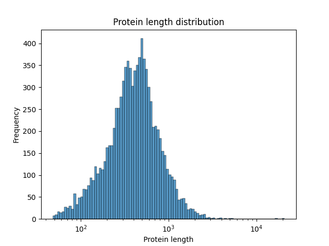
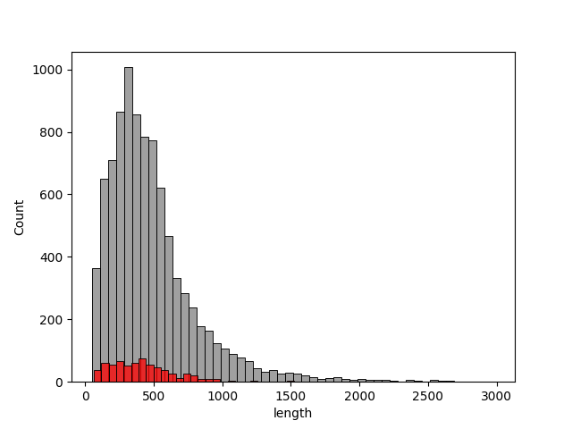
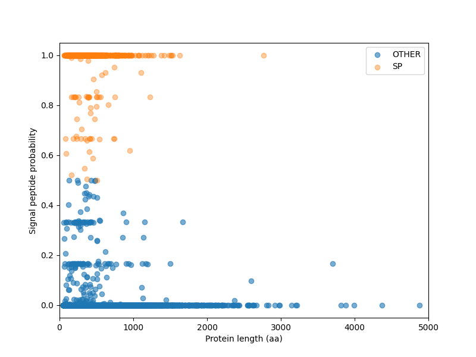

# Enzyme Genome Mining Course

Learning project exploring fungal proteomes and enzyme discovery pipelines.

## Module 1 – Proteome Exploration

Tasks:
- Downloaded Trichoderma reesei reference proteome
- Parsed FASTA using Biopython
- Calculated proteome statistics
- Visualized protein length distribution

Key results:
- Proteome size: 9115 proteins
- Median protein length: 409 aa
- Long-tail distribution due to NRPS enzymes

## Protein length distribution

## Module 2 – Secretome prediction

The secreted protein repertoire (*secretome*) of **Trichoderma reesei QM6a** was predicted using **SignalP 6.0**, a neural-network-based tool for identifying N-terminal signal peptides that direct proteins to the secretory pathway.

Signal peptides are characteristic of extracellular enzymes and therefore represent the first filtering step in enzyme genome mining.

---

### SignalP Models

Two SignalP models were evaluated:

| Model | Description | Runtime | Predicted Secreted Proteins |
|------|-------------|--------|-----------------------------|
| Fast | Distilled neural network approximation | ~46 min | 666 |
| Slow-sequential | Ensemble of 6 neural networks | ~4.6 h | 679 |

The **slow-sequential model** provides higher accuracy at the cost of longer runtime.

---

### Model Comparison

Predictions from both models were compared to assess consistency.

| Metric | Value |
|------|------|
| Total proteins in proteome | 9115 |
| Prediction disagreements | 61 |
| Fraction of proteome | ~0.7% |
| Fraction of secretome | ~9% |

Although most disagreements occurred near the classification boundary, several proteins with **very high signal peptide probability (>0.99)** in the slow model were classified as **OTHER** by the fast model.

Because of this, the **slow-sequential predictions were used for downstream analysis**.

---

### Secretome Statistics 

The predicted secretome contains: 679 proteins (~7.4% of the proteome)

Length distribution:

| Metric | Value |
|------|------|
| Mean length | ~432 aa |
| Median length | ~394 aa |
| Shortest | 65 aa |
| Longest | 2770 aa |

Most secreted proteins fall within the **250–600 amino acid range**, typical for fungal extracellular enzymes.

---

### Visualization

A scatter plot of **protein length vs signal peptide probability** reveals a clear separation between intracellular and secreted proteins.

Secreted proteins form a distinct band of high signal peptide probability.

---

### Observations

Several unusually large secreted proteins (>1500 aa) were identified.  
These likely represent **multi-domain extracellular proteins**, such as:

- chitinases
- cell wall remodeling enzymes
- modular carbohydrate-active enzymes

For example:

| Protein | Length (aa) | Annotation |
|-------|-------|-------|
| G0RT37 | 1531 | Chitinase |
| G0RCD8 | 1508 | Vacuolar protein sorting protein |
| G0RU23 | 2770 | Predicted protein |

These proteins will be further investigated during enzyme family annotation.

---

### Output Data

The following datasets were generated:
results/proteome_signalp_annotated.csv
results/secretome_predictions.csv
results/secretome.fasta