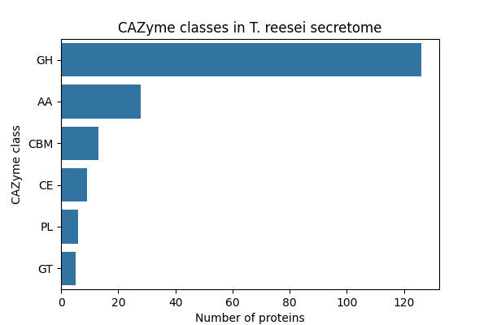
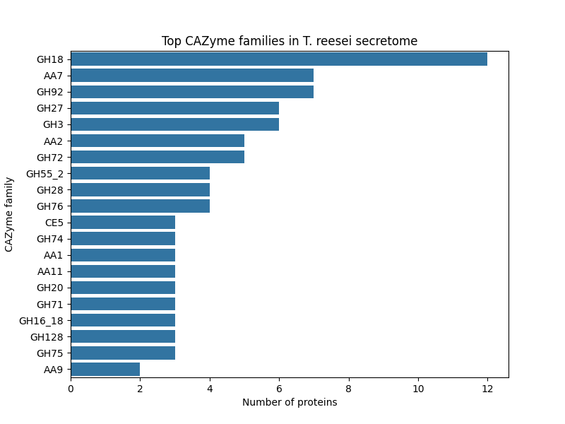
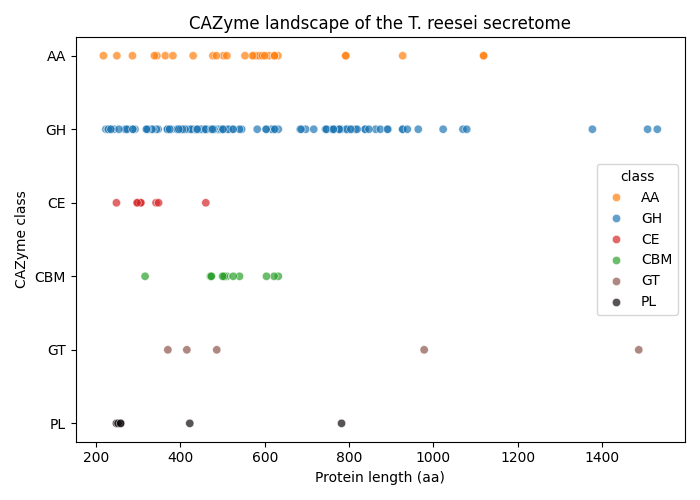
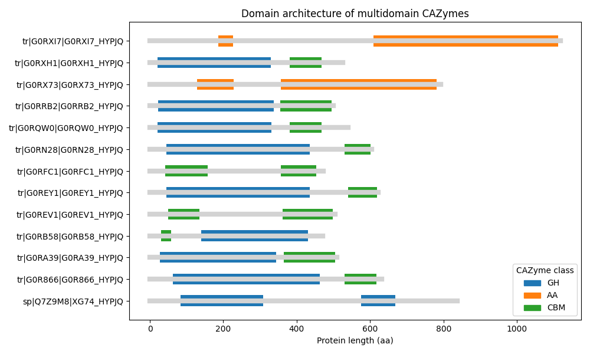

# Fungal Enzyme Genome Mining Pipeline

Learning project exploring fungal proteomes and enzyme discovery pipelines.

## Module 1 – Proteome Exploration

Tasks:
- Downloaded Trichoderma reesei reference proteome
- Parsed FASTA using Biopython
- Calculated proteome statistics
- Visualized protein length distribution

Key results:
- Proteome size: 9115 proteins
- Median protein length: 409 aa
- Long-tail distribution due to NRPS enzymes

## Protein length distribution

## Module 2 – Secretome prediction

The secreted protein repertoire (*secretome*) of **Trichoderma reesei QM6a** was predicted using **SignalP 6.0**, a neural-network-based tool for identifying N-terminal signal peptides that direct proteins to the secretory pathway.

Signal peptides are characteristic of extracellular enzymes and therefore represent the first filtering step in enzyme genome mining.

---

### SignalP Models

Two SignalP models were evaluated:

| Model | Description | Runtime | Predicted Secreted Proteins |
|------|-------------|--------|-----------------------------|
| Fast | Distilled neural network approximation | ~46 min | 666 |
| Slow-sequential | Ensemble of 6 neural networks | ~4.6 h | 679 |

The **slow-sequential model** provides higher accuracy at the cost of longer runtime.

---

### Model Comparison

Predictions from both models were compared to assess consistency.

| Metric | Value |
|------|------|
| Total proteins in proteome | 9115 |
| Prediction disagreements | 61 |
| Fraction of proteome | ~0.7% |
| Fraction of secretome | ~9% |

Although most disagreements occurred near the classification boundary, several proteins with **very high signal peptide probability (>0.99)** in the slow model were classified as **OTHER** by the fast model.

Because of this, the **slow-sequential predictions were used for downstream analysis**.

---

### Secretome Statistics 

The predicted secretome contains: 679 proteins (~7.4% of the proteome)

Length distribution:

| Metric | Value |
|------|------|
| Mean length | ~432 aa |
| Median length | ~394 aa |
| Shortest | 65 aa |
| Longest | 2770 aa |

Most secreted proteins fall within the **250–600 amino acid range**, typical for fungal extracellular enzymes.

---

### Visualization

A scatter plot of **protein length vs signal peptide probability** reveals a clear separation between intracellular and secreted proteins.

Secreted proteins form a distinct band of high signal peptide probability.

---

### Observations

Several unusually large secreted proteins (>1500 aa) were identified.  
These likely represent **multi-domain extracellular proteins**, such as:

- chitinases
- cell wall remodeling enzymes
- modular carbohydrate-active enzymes

For example:

| Protein | Length (aa) | Annotation |
|-------|-------|-------|
| G0RT37 | 1531 | Chitinase |
| G0RCD8 | 1508 | Vacuolar protein sorting protein |
| G0RU23 | 2770 | Predicted protein |

These proteins will be further investigated during enzyme family annotation.

---

### Output Data

The following datasets were generated:
results/proteome_signalp_annotated.csv
results/secretome_predictions.csv
results/secretome.fasta

## Module 3 — CAZyme Annotation and Domain Architecture Analysis

### Objective

The goal of this module was to identify **carbohydrate-active enzymes (CAZymes)** within the predicted *Trichoderma reesei* secretome and to analyze their **domain architecture**.  
CAZymes are responsible for degradation, modification, and synthesis of complex carbohydrates and are central to the industrial relevance of *T. reesei* as a biomass-degrading organism.

The workflow consisted of:

1. Detecting CAZyme domains using **dbCAN HMM profiles**
2. Filtering HMM hits to remove artifacts
3. Reconstructing domain architectures of secreted enzymes
4. Quantifying CAZyme composition in the secretome

---

# CAZyme Detection

Hidden Markov Models (HMMs) from the **dbCAN CAZyme database** were used to scan the predicted secreted proteins.

hmmscan --domtblout dbcan_hits.txt dbCAN-HMMdb.fasta secretome.fasta

This initial scan produced:

| Stage | Number of Hits |
|------|------|
| Raw HMM hits | **688** |

Raw HMMER output often contains:

- overlapping hits
- fragmented alignments
- partial matches to conserved motifs

Therefore additional filtering steps were required.

---

# Domain Filtering Pipeline

To obtain biologically meaningful annotations, three sequential filtering steps were applied.

## 1. Overlap Filtering

Many HMMER hits overlap strongly and represent the same domain detected multiple times.

Hits were filtered by removing domain matches that overlap by more than **20%** with a higher-scoring hit on the same protein.

688 → 248 hits

---

## 2. Coverage Filtering

Some HMM matches correspond to short fragments of a domain rather than the full catalytic region.

Coverage of each HMM model was calculated as:
coverage = (hmm_to − hmm_from) / model_length

Domains covering **< 35% of the HMM model** were removed.

248 → 191 hits

---

## 3. Domain Merging

Large catalytic domains may sometimes appear as multiple adjacent HMM hits due to insertions or alignment fragmentation.

Adjacent hits of the **same CAZy family** separated by small gaps were merged into a single domain.

191 → 187 final domain annotations

This step collapses artifacts such as:
GH74 + GH74 + GH74 → GH74
AA2 + AA2 + AA2 → AA2

while preserving real multidomain architectures.

---

# CAZyme Composition of the Secretome

From **679 predicted secreted proteins**, the pipeline identified:

174 secreted CAZyme proteins

This corresponds to:
**25.6%** of the secretome

Such a high CAZyme fraction is typical for **filamentous fungi specialized in plant biomass degradation**, including *Trichoderma reesei*.

---

## CAZyme Class Distribution

To better understand the functional composition of the secretome, CAZyme domains were grouped into their major CAZy classes.

The CAZy classification system defines six primary enzyme classes:

| Class | Description |
|------|-------------|
| GH | Glycoside Hydrolases – hydrolysis of glycosidic bonds |
| GT | Glycosyltransferases – synthesis of glycosidic bonds |
| PL | Polysaccharide Lyases – non-hydrolytic polysaccharide cleavage |
| CE | Carbohydrate Esterases – removal of ester modifications |
| AA | Auxiliary Activities – oxidative enzymes supporting biomass degradation |
| CBM | Carbohydrate-Binding Modules – substrate-binding domains |

The distribution of CAZyme classes in the *T. reesei* secretome is shown below.

Glycoside hydrolases (GH) dominate the secretome, reflecting the strong specialization of *T. reesei* in degradation of plant polysaccharides such as cellulose and hemicellulose.

Auxiliary activity enzymes (AA) represent oxidative enzymes that assist in lignocellulose degradation, while carbohydrate-binding modules (CBM) appear as accessory domains that improve substrate targeting.

---

## Top CAZyme Families

The most abundant CAZyme families in the secretome were identified by counting filtered domain annotations.

The dominant enzyme families include:

- **GH18** – chitinases involved in fungal cell wall remodeling
- **GH3** – β-glucosidases responsible for hydrolysis of cellobiose
- **GH27 / GH28 / GH92** – hemicellulose and polysaccharide degradation enzymes
- **AA families** – oxidative enzymes supporting lignocellulose breakdown

These results are consistent with the known enzymatic capabilities of *Trichoderma reesei*, a filamentous fungus widely used for industrial enzyme production and biomass conversion.

---

## CAZyme Landscape of the Secretome

To explore the structural diversity of the detected enzymes, CAZyme classes were visualized against protein length.

The figure highlights the distribution of CAZyme classes across protein sizes.  
Glycoside hydrolases dominate the secretome and span a wide range of protein lengths, while carbohydrate-binding modules appear primarily as accessory domains in multidomain enzymes.

Auxiliary activity enzymes tend to be longer proteins, consistent with their complex catalytic mechanisms involved in oxidative biomass degradation.

---

# Domain Architecture Statistics

Most CAZymes consist of a **single catalytic domain**, while a smaller fraction contains additional carbohydrate-binding modules (CBMs) or duplicated domains.

| Domain count | Proteins |
|------|------|
| 1 domain | **161** |
| 2 domains | **13** |

Summary statistics:

| Metric | Value |
|------|------|
| Mean domains per protein | 1.07 |
| Median domains | 1 |
| Maximum domains | 2 |

---

# Most Common CAZyme Architectures

| Architecture | Count |
|------|------|
| GH18 | 12 |
| GH92 | 7 |
| AA7 | 7 |
| GH3 | 6 |
| GH27 | 6 |
| GH55_2 | 4 |
| GH76 | 4 |
| GH28 | 4 |
| AA2 | 3 |
| GH20 | 3 |
| AA1 | 3 |
| GH72 | 3 |
| AA11 | 3 |
| GH16_18 | 3 |
| GH128 | 3 |
| CE5 | 3 |
| GH75 | 3 |

Examples of **true multidomain enzymes** include:

| Architecture | Count |
|------|------|
| GH71 + CBM24 | 2 |
| GH72 + CBM43 | 2 |
| GH54 + CBM42 | 2 |

These architectures are typical for fungal enzymes where a **catalytic domain is combined with a carbohydrate-binding module (CBM)** to improve substrate targeting.

---

## Domain Architecture of Multidomain CAZymes

To visualize enzyme modularity, domain architectures were reconstructed from filtered CAZyme annotations.

Most secreted CAZymes contain a single catalytic domain.  
However, several enzymes display **multidomain architectures**, typically combining a catalytic domain with a carbohydrate-binding module (CBM).

Examples identified in the *T. reesei* secretome include:

| Architecture | Example |
|------|------|
| GH54 + CBM42 | hemicellulose-active enzyme with substrate binding module |
| GH71 + CBM24 | glucanase associated with carbohydrate binding |
| AA2 + AA2 | duplicated auxiliary activity oxidase domains |

Such modular architectures enhance enzyme efficiency by coupling **substrate binding** with **catalytic activity**, a common strategy in fungal biomass-degrading enzymes.

# Interpretation

The recovered CAZyme repertoire matches expectations for *T. reesei*, a fungus specialized in lignocellulose degradation.

Detected enzyme families include:

- **GH families** – glycoside hydrolases (cellulose, hemicellulose, chitin degradation)
- **AA families** – auxiliary activity enzymes (oxidative lignocellulose degradation)
- **CE families** – carbohydrate esterases
- **CBM modules** – carbohydrate-binding modules enhancing substrate interaction

The dominance of single-domain enzymes is typical for fungal secretomes, while CBM-containing enzymes represent specialized adaptations for insoluble substrates such as cellulose.

---

# Output Files

The final CAZyme annotations are stored in:

results/cazyme_architecture_filtered.csv
results/cazyme_architecture_filtered_merged.csv

Example:

| protein_id | length | domain_count | domain_architecture |
|------|------|------|------|
| sp\|Q7Z9M8\|XG74_HYPJQ | 838 | 1 | GH74 |
| tr\|G0RX73\|G0RX73_HYPJQ | 792 | 2 | AA2 + AA2 |
| tr\|G0RGK8\|G0RGK8_HYPJQ | 964 | 2 | GH31 + GH31 |

---

# Conclusion

This module reconstructed the **secreted CAZyme repertoire of *Trichoderma reesei*** using a reproducible genome-mining workflow.

The pipeline demonstrates how proteome-scale enzyme discovery can be performed using:

- HMM-based domain detection
- systematic filtering of domain hits
- domain architecture reconstruction
- quantitative secretome analysis

The resulting dataset provides a foundation for identifying **candidate industrial enzymes** involved in plant biomass degradation.

## Project Summary

This project demonstrates the construction of a basic genome-mining pipeline for enzyme discovery in filamentous fungi.

Starting from a reference fungal proteome (*Trichoderma reesei*), the workflow reconstructs the organism’s secreted enzyme repertoire through several analysis stages:

1. **Proteome exploration** – working with genomic protein datasets
2. **Secretome prediction** – identifying proteins likely to be secreted
3. **CAZyme annotation** – detecting carbohydrate-active enzymes using HMM models
4. **Domain architecture reconstruction** – identifying catalytic domains and accessory modules
5. **Secretome composition analysis** – quantifying enzyme classes and families

The final result is a structured catalogue of secreted CAZymes, including domain architectures and enzyme family annotations.

This type of analysis forms the basis of **enzyme genome mining**, a strategy widely used in biotechnology to identify new enzymes for applications such as biomass degradation, food processing, and industrial biocatalysis.

---

## Key Skills Demonstrated

This project demonstrates practical experience with:

- Python-based bioinformatics analysis
- Working with protein FASTA datasets
- Secretome prediction using SignalP
- Hidden Markov Model (HMM) annotation with HMMER
- CAZyme annotation using the dbCAN database
- Domain architecture reconstruction
- Data visualization with Python (pandas, seaborn, matplotlib)
- Reproducible bioinformatics workflows

---

## Limitations

This project focuses on demonstrating the **analysis pipeline**, rather than discovering new enzymes.

In real enzyme discovery workflows, this pipeline would typically be applied to **many genomes simultaneously**, followed by comparative analysis to identify novel enzyme candidates.
